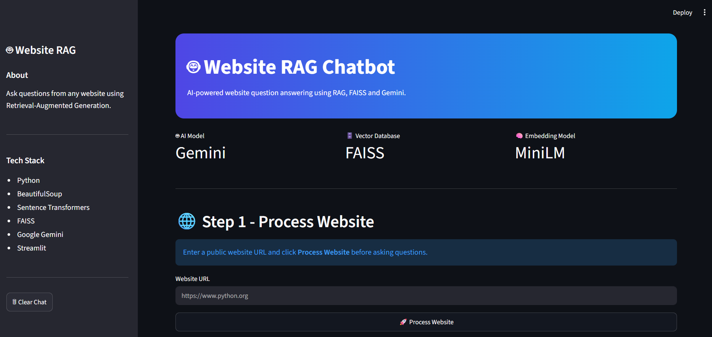
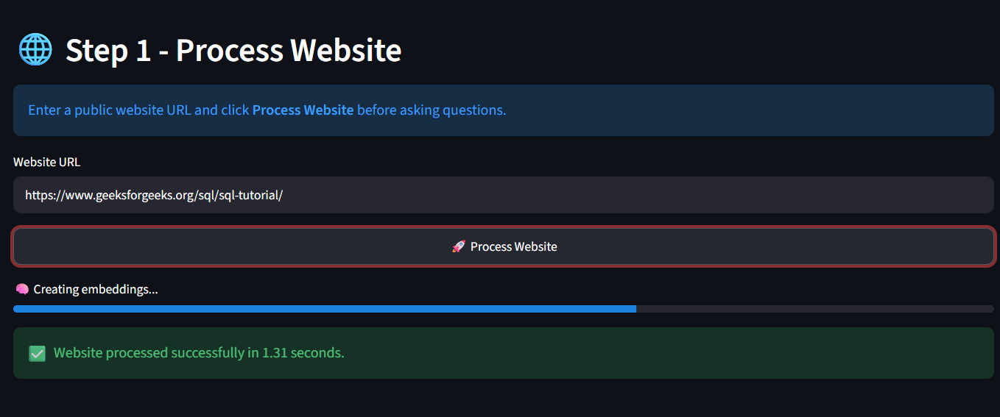
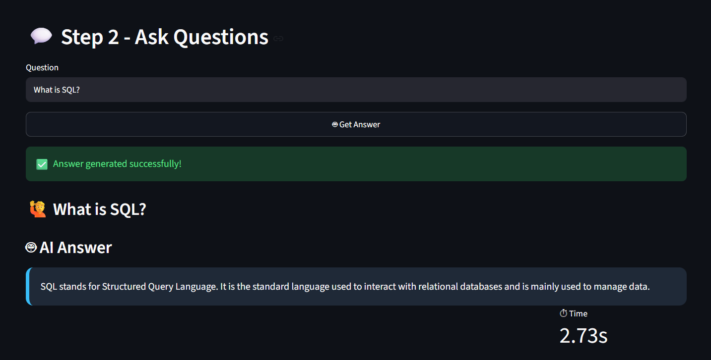

# Website RAG Chatbot


## 📌 Project Overview

This project is being developed as part of the **ClaySys AI Hackathon 2026**.

The goal of this project is to build a **Retrieval-Augmented Generation (RAG)** chatbot that can answer user questions based on the content of any website.

The chatbot performs the following tasks:
- Scrapes website content
- Extracts readable text
- Splits the content into smaller chunks
- Converts chunks into embeddings
- Stores embeddings in a FAISS vector database
- Retrieves relevant information using semantic search
- Generates context-aware answers using Google Gemini
- Provides an interactive web interface using Streamlit

---

## 📌 Project Workflow

```text
Website URL
      │
      ▼
Website Scraping
      │
      ▼
Text Extraction
      │
      ▼
Text Chunking
      │
      ▼
Embeddings Generation
      │
      ▼
FAISS Vector Database
      │
      ▼
Semantic Retrieval
      │
      ▼
Google Gemini API
      │
      ▼
AI Generated Response

```

## 📸 Application Screenshots

The following screenshots demonstrate the main stages of the application.

### 🏠 Home Page



---

### 🌐 Website Processing



---

### 🤖 AI Generated Answer




---

## ✨ Features

- Scrapes content from any public website
- Extracts and cleans website text
- Splits text into manageable chunks
- Generates semantic embeddings using Sentence Transformers
- Stores embeddings in a FAISS vector database
- Retrieves relevant content using semantic search
- Generates AI-powered answers using Google Gemini
- Interactive web interface using Streamlit
- Easy-to-use and modular project structure

---

## 🚀 Current Progress

### ✅ Milestone 1: Website Scraping

Completed:
- Created the project structure
- Set up a Python virtual environment
- Installed required libraries
- Built a website scraper using Requests and BeautifulSoup
- Downloaded website HTML
- Removed unnecessary HTML elements (`script` and `style`)
- Extracted readable website content
- Saved extracted content into `website.txt`

---

### ✅ Milestone 2: Text Chunking

Completed:
- Implemented a text chunking module
- Split website content into smaller chunks
- Stored chunks in `chunks.json`
- Prepared the data for semantic search

---

### ✅ Milestone 3: Embeddings & Vector Database

Completed:
- Installed Sentence Transformers and FAISS
- Generated embeddings using the `all-MiniLM-L6-v2` model
- Converted text chunks into vector representations
- Created a FAISS vector database
- Stored embeddings for semantic search
- Saved the vector index as `website.index`

---

### ✅ Milestone 4: Retrieval & Gemini Integration

Completed:
- Implemented semantic retrieval using FAISS
- Converted user questions into embeddings
- Retrieved the most relevant text chunk
- Integrated Google Gemini API
- Generated context-aware answers using retrieved website content
- Completed the backend RAG pipeline

---

### ✅ Milestone 5: Basic Streamlit User Interface

Completed:
- Built a Streamlit web interface
- Added website URL input
- Processed website content through the UI
- Connected the complete RAG pipeline
- Added question input for users
- Displayed AI-generated answers
- Successfully tested the chatbot with multiple websites

---

## 🛠 Technologies Used

- Python
- Requests
- BeautifulSoup
- JSON
- Sentence Transformers
- FAISS
- Google Gemini API
- Streamlit
- python-dotenv
- NumPy
- Git
- GitHub

---


## 📂 Project Structure

```text

website-rag-chatbot/
│
├── screenshots/
│   ├── home.png
│   ├── processing.png
│   └── answer.png
│
├── app.py
├── streamlit_app.py
├── scraper.py
├── chunker.py
├── vector_store.py
├── retriever.py
├── gemini_chat.py
├── website.txt
├── chunks.json
├── website.index
├── requirements.txt
├── README.md
└── .gitignore
---
```


## ▶️ How to Run

### 1. Clone the repository

```bash
git clone https://github.com/Soumya8281/website-rag-chatbot.git
```

### 2. Navigate to the project folder

```bash
cd website-rag-chatbot
```

### 3. Create a virtual environment

```bash
python -m venv venv
```

### 4. Activate the virtual environment

**Windows**

```bash
venv\Scripts\activate
```

### 5. Install dependencies

```bash
pip install -r requirements.txt
```

### 6. Create a `.env` file

```env
GEMINI_API_KEY=YOUR_API_KEY
```

### 7. Run the application

```bash
python -m streamlit run streamlit_app.py
```

---

## 🎯 Future Improvements

- Improve the user interface with advanced chat features
- Add support for PDF document analysis
- Enable processing of multiple websites
- Optimize retrieval accuracy and speed
- Deploy the application on Streamlit Community Cloud
- Add user authentication and session management

---
## 👩‍💻 Developed By

**Soumya S Nair**

Developed as part of the **ClaySys AI Hackathon 2026**.

